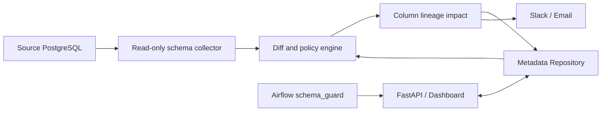

# Schema Sentry

PostgreSQL의 실제 스키마를 Metadata Repository 기준선과 비교하고, 깨질 파이프라인을 실행 전에 차단하는 데이터 스키마 변경 감지·알림 서비스입니다. 2주 동안 설계·구현한 개인 포트폴리오 프로젝트이며, 개인 미니 PC에서 Docker Compose로 운영할 수 있습니다.

## Problem

원본 테이블의 컬럼 삭제나 호환되지 않는 타입 변경은 배치가 실행된 뒤에야 장애로 드러나는 경우가 많습니다. Schema Sentry는 다음 흐름으로 장애 발견 시점을 앞당깁니다.

1. 읽기 전용 계정으로 PostgreSQL의 실제 컬럼 메타데이터를 수집합니다.
2. 별도 PostgreSQL Metadata Repository의 기준선과 비교합니다.
3. 변경을 `INFO`, `WARNING`, `BREAKING`으로 분류합니다.
4. YAML 컬럼 리니지를 따라 영향받는 Airflow DAG와 downstream 컬럼을 찾습니다.
5. Slack/이메일로 알리고, `BREAKING` 변경이 열린 동안 파이프라인을 차단합니다.

핵심 목표는 채용 공고의 **Metadata Repository 정합성 검증** 업무를 실행 가능한 시스템으로 보여주는 것입니다.

## Five-Minute Demo

Git, GNU Make, Bash, curl, Docker Engine과 Docker Compose 2.24.4 이상을 준비한 Linux/macOS 환경에서 실행합니다. Windows에서는 WSL2 사용을 권장합니다.

```bash
git clone https://github.com/kms5378/schema-sentry.git
cd schema-sentry
make demo
```

스크립트는 기준선 스캔 → `public.purchases.amount`의 `numeric(12,2)`에서 `varchar`로 변경 → breaking drift 및 `daily_revenue` 영향 확인 → pipeline validation `409` 확인 → 이메일 확인 → 스키마 복구 → validation `200` 확인을 자동 수행합니다.

```text
baseline scan: completed (...)
breaking drift: detected (...)
affected DAG: daily_revenue
pipeline validation: blocked
email notification: sent
restoration scan: resolved (...)
pipeline validation: safe
```

데모는 `schema-sentry-demo`라는 별도 Compose 프로젝트, 전용 DB 이름·볼륨·포트만 사용합니다. 실행 후 [대시보드](http://127.0.0.1:8100/)와 [Mailpit](http://127.0.0.1:8125/)에서 결과를 확인할 수 있습니다. 데모 데이터까지 정리하려면 다음을 실행합니다.

```bash
docker compose -p schema-sentry-demo -f docker-compose.yml -f docker-compose.demo.yml down --volumes
```

## What It Detects

| 변경 | 기본 판정 | 동작 |
|---|---|---|
| nullable 컬럼 추가 | `INFO` | 기록 |
| `NOT NULL` 컬럼 추가 | `WARNING` | 기록 |
| 미사용 컬럼 삭제 | `WARNING` | 기록 |
| 리니지에 등록된 컬럼 삭제 | `BREAKING` | 영향 분석·알림·파이프라인 차단 |
| 정수/문자/숫자 타입 확장 | `WARNING` | 기록 |
| 타입 축소 또는 타입 계열 변경 | `BREAKING` | 영향 분석·알림·파이프라인 차단 |
| nullability 변경 | `WARNING` 또는 `BREAKING` | 의존 컬럼의 non-null 보장이 약해지면 차단 |

타입 별칭과 길이·precision·scale을 정규화한 뒤 비교하며, 컬럼 순서 변경은 drift로 보지 않습니다. 동일한 미해결 변경은 fingerprint로 중복 알림을 막습니다.

## Architecture



비즈니스 규칙은 프레임워크와 분리된 domain/application 계층에 있고, PostgreSQL·Slack·SMTP·FastAPI는 adapter 역할을 합니다. 스캔 결과와 alert outbox는 한 트랜잭션에 저장되며 외부 알림 실패가 완료된 스캔을 롤백하지 않습니다.

자세한 구성, ERD, 요청 흐름, API와 정책표는 [아키텍처 문서](docs/architecture.md)를 참고하세요.

## Pipeline Guard

Airflow의 `daily_revenue` DAG는 집계 작업 전에 아래 endpoint를 호출합니다.

```http
POST /api/v1/pipelines/daily_revenue/validate
X-API-Key: <token>
```

- 안전하면 `200 {"safe": true, ...}`를 반환하고 집계를 실행합니다.
- 해당 파이프라인에 영향을 주는 열린 `BREAKING` 변경이 있으면 `409`를 반환하고 `schema_guard` task가 downstream 작업을 차단합니다.
- Schema Sentry API 자체가 응답하지 않으면 fail-open하지 않고 운영 오류로 실패합니다.

샘플 구현은 [Airflow DAG](airflow/dags/daily_revenue.py)와 [API client](airflow/dags/schema_sentry_client.py)에 있습니다.

## Local Development

Python 3.12, [uv](https://docs.astral.sh/uv/), Docker Compose가 필요합니다.

```bash
uv sync --frozen
docker compose up -d --wait source-db source-permissions-init metadata-db mailpit
docker compose run --rm api .venv/bin/alembic upgrade head
docker compose up -d --build
```

기본 주소는 dashboard/API `http://localhost:8000`, Airflow `http://localhost:8080`, Mailpit `http://localhost:8025`입니다. 로컬 설정은 개발 전용이며 외부 네트워크에 공개하면 안 됩니다.

주요 개발 명령은 다음과 같습니다.

```bash
make check
make demo
docker compose down
```

## Mini PC Deployment

운영 overlay는 Caddy만 80/443 포트를 공개하고, API·PostgreSQL·Airflow·Mailpit은 Compose 내부 네트워크에 둡니다. HTTPS와 Caddy Basic Auth, 애플리케이션 API key, migration gate, read-only filesystem, `no-new-privileges`, bounded JSON log를 적용합니다.

```bash
cp .env.example .env.production
# .env.production에 강한 개별 secret, domain, bcrypt hash 설정
make prod-config
make prod-up
export SCHEMA_SENTRY_BASE_URL=https://schema.example.com
export SCHEMA_SENTRY_ADMIN_USER=portfolio-owner
make prod-smoke
```

실제 배포 전에 방화벽에서 80/443만 전달하고 `.env.production`을 Git에 추가하지 마세요. 백업·복구, secret 교체, 업그레이드와 장애 대응은 [운영 문서](docs/operations.md)에 있습니다.

## Testing

```bash
uv run ruff check .
uv run mypy src
uv run pytest --cov=src/schema_sentry --cov-report=term-missing --cov-fail-under=85
docker compose run --rm --no-deps airflow-api-server bash -c 'pytest /opt/airflow/tests -q'
```

테스트는 순수 정책 단위 테스트, 실제 PostgreSQL DDL·migration 통합 테스트, FastAPI 계약 테스트, Airflow guard 테스트, 전체 데모와 알림 채널 실패 격리 시스템 테스트를 포함합니다. 현재 품질 기준은 source branch coverage 85% 이상입니다.

## Job Responsibility Mapping

이 프로젝트는 [KRAFTON Data Foundation 엔지니어 인턴 공고](https://job-boards.greenhouse.io/krafton_jungle_twelve/jobs/8653074002)의 업무와 다음처럼 연결됩니다.

| 공고 업무 | 저장소 증거 |
|---|---|
| 데이터 파이프라인 구현·테스트·모니터링 보조 | Airflow 정기 스캔 DAG, `daily_revenue` pipeline guard, DAG 테스트 |
| Metadata Repository 정합성 검증 | 실제 PostgreSQL 수집, 기준선/observed snapshot/change lifecycle, YAML lineage sync |
| 데이터 조회·검증 API 개발 보조 | FastAPI scan/query/accept/retry 및 `pipeline/{key}/validate` API |
| 파이프라인·데이터 정의·운영 문서화 | README, architecture, operations, portfolio mapping 문서 |
| 관련 우대 경험 | Python·SQL·FastAPI·Airflow·PostgreSQL·Docker Compose를 하나의 운영 흐름으로 통합 |

파일과 테스트 단위의 상세 근거는 [직무 매핑 문서](docs/portfolio-mapping.md)에 정리했습니다.

## Trade-offs

- 메타데이터의 이력·트랜잭션·동시성 제어를 보여주기 위해 별도 PostgreSQL repository를 사용했습니다.
- 2주 범위에서 정확한 column lineage를 보여주기 위해 SQL 자동 파싱 대신 검증 가능한 YAML 선언을 선택했습니다.
- 변경 감지 지연을 감수하고 운영 복잡도가 낮은 10분 polling을 선택했습니다.
- 범용 카탈로그 UI 대신 스캔·영향·알림·baseline 수락에 집중한 단일 화면을 구현했습니다.
- 서비스 내부 RBAC 대신 단일 운영자 모델과 reverse proxy 인증을 사용합니다.

## Future Work

- PostgreSQL 외 warehouse adapter와 source별 정책 확장
- event trigger/CDC 기반 준실시간 DDL 감지
- SQL parser 또는 OpenLineage를 이용한 자동 lineage 수집
- SSO/RBAC와 감사 로그
- Slack interactive action과 운영 지표/trace
- core 완료 후 read-only MCP surface 추가
