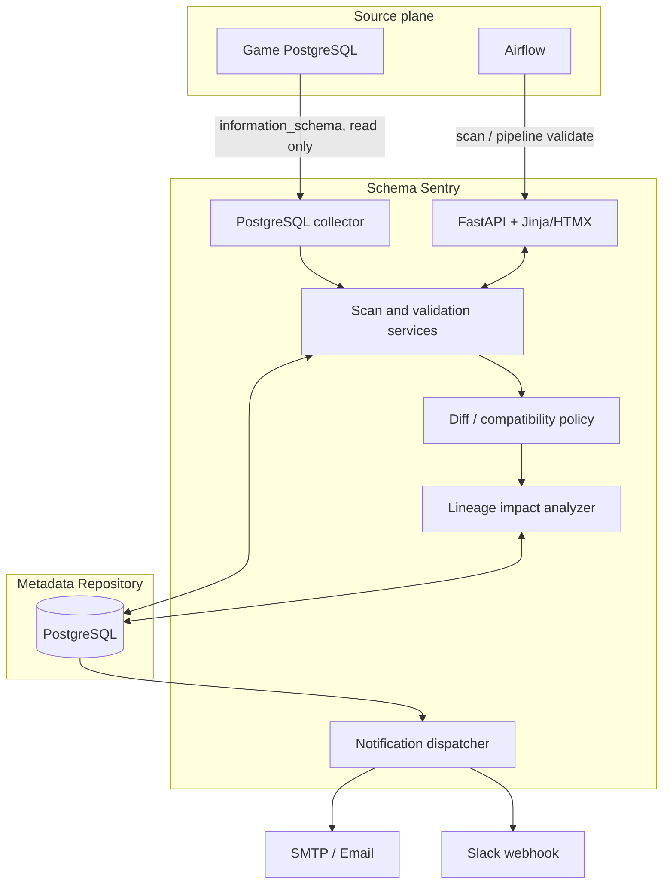
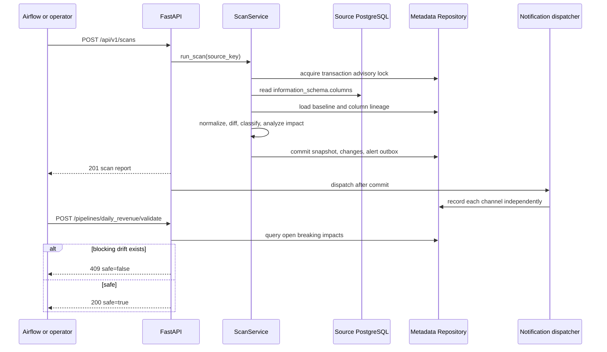
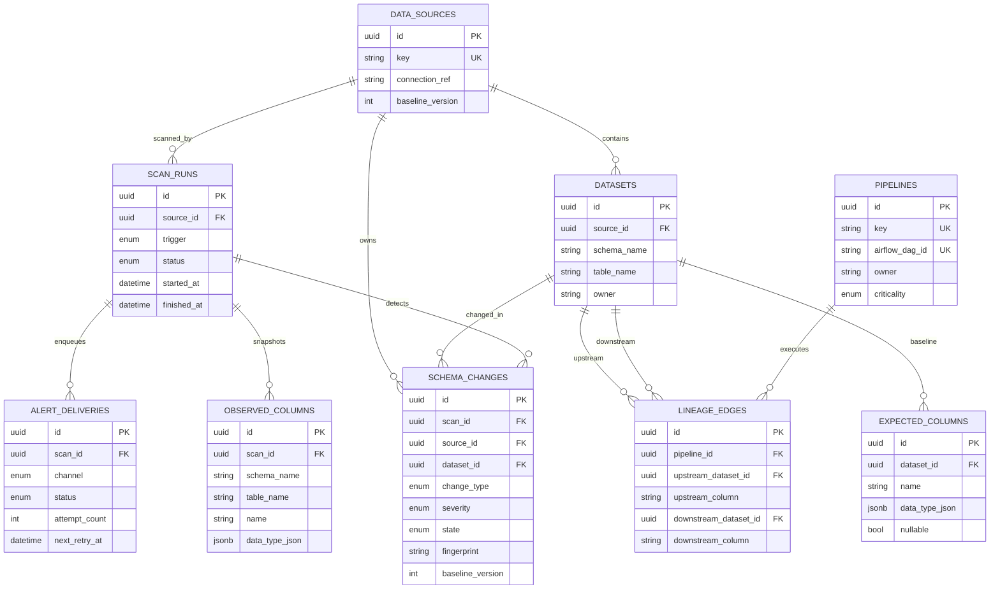

# Schema Sentry Architecture

## Component view

Domain code owns canonical column types, comparison policy, fingerprinting and lineage traversal. Application services coordinate transactions and ports. SQLAlchemy, psycopg, FastAPI, SMTP, Slack and Airflow remain at infrastructure/API boundaries.

## Scan and guard sequence

The transaction-scoped PostgreSQL advisory lock rejects concurrent scans for the same source and releases automatically on commit or rollback. An incomplete source snapshot is recorded as a failed scan and is never compared or promoted.

## Metadata Repository ER diagram

An open-change partial unique index on `(source_id, fingerprint)` deduplicates unresolved drift. `(scan_id, channel)` is unique so one scan cannot enqueue duplicate deliveries for one channel.

## Baseline and change lifecycle

1. The first complete scan for a source creates `expected_columns` and emits no drift.
2. Later complete observations are persisted and compared with that baseline.
3. New drift becomes `OPEN`; stable fingerprints suppress duplicate open records and repeat alerts.
4. Acceptance requires the baseline version seen by the operator. A stale version returns `409`.
5. Acceptance updates the affected baseline definition, marks the change `ACCEPTED`, and increments the source baseline version.
6. If the source returns to the baseline without acceptance, the open change becomes `RESOLVED`.

## Compatibility policy

| Observed change | Severity | Rationale |
|---|---|---|
| Add nullable column | `INFO` | Existing readers remain compatible |
| Add non-null column | `WARNING` | Writers may need a value/default |
| Drop unregistered column | `WARNING` | No known lineage dependency |
| Drop registered input column | `BREAKING` | A known pipeline reads it |
| Integer, varchar or numeric capacity widening | `WARNING` | Compatible but review-worthy |
| Capacity narrowing | `BREAKING` | Existing values/readers may fail |
| Cross-family type change | `BREAKING` | No safe implicit compatibility assumption |
| Non-null to nullable | `BREAKING` for a registered input, otherwise `WARNING` | Downstream may rely on non-null input |
| Nullable to non-null | `WARNING` | Writers or existing data may violate it |

Column order is ignored. PostgreSQL aliases such as `int4`, `int8`, `varchar`, `decimal`, `timestamp` and `timestamptz` are canonicalized before comparison. A possible rename remains an explicit drop plus add; the system never silently accepts it.

## API contract

| Method | Path | Success | Important failures |
|---|---|---|---|
| `POST` | `/api/v1/scans` | `201`, persisted scan report | `404` source, `409` concurrent scan, `503` source failure |
| `GET` | `/api/v1/scans/latest` | Latest scan, changes, impacts, deliveries | `404` when no scan exists |
| `GET` | `/api/v1/scans/{scan_id}` | One persisted scan | `404` |
| `POST` | `/api/v1/changes/{change_id}/accept` | Accepted baseline version | `404`, `409` stale baseline |
| `POST` | `/api/v1/pipelines/{pipeline_key}/validate` | `200 safe=true` | `404` pipeline, `409 safe=false` |
| `POST` | `/api/v1/alerts/{delivery_id}/retry` | Delivery attempt result | `404`, `409` not due/max attempts |
| `GET` | `/health/live` | Process liveness | — |
| `GET` | `/health/ready` | DB and Alembic readiness | `503` |
| `GET` | `/` | Server-rendered dashboard | — |

Mutating endpoints require `X-API-Key` unless authentication is explicitly disabled in development. In production, Caddy authenticates the operator and forwards the trusted identity; dashboard actions additionally enforce same-origin requests.

## Alert delivery

New `WARNING` or `BREAKING` drift creates one outbox row per configured channel in the same transaction as the completed scan. Dispatch happens only after commit. Each channel locks and records its own attempt, so an SMTP failure cannot roll back the scan or a successful Slack delivery. The first and second failures become retryable after 60 and 300 seconds; a third failure is final and stores no next retry time. Provider errors are sanitized before persistence/logging.

## Deployment boundary

Production combines `docker-compose.yml` and `docker-compose.prod.yml`. Caddy is the only public service. It terminates HTTPS, performs Basic Auth and proxies the trusted user. Databases, API, Mailpit and Airflow have no host ports in the production overlay. Migration completion gates API startup; containers use read-only filesystems where possible, `no-new-privileges`, restart policies and bounded JSON logs.
