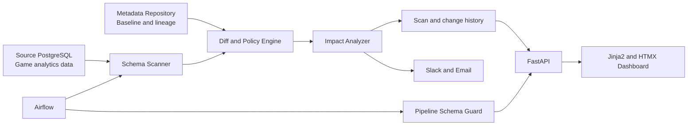

# Schema Sentry Design

## 1. Project Context

Schema Sentry is a two-week solo portfolio project for the KRAFTON Data Foundation Engineer internship. The target role explicitly includes validating whether data catalogs, schemas, and lineage metadata match actual data, identifying inconsistencies, supporting data-pipeline monitoring, and developing data validation APIs.

The project demonstrates those responsibilities through a small but complete operational workflow:

1. Observe an actual PostgreSQL schema.
2. Compare it with the Metadata Repository baseline.
3. Classify schema drift and identify breaking changes.
4. Trace affected Airflow pipelines through column-level lineage.
5. Warn through Slack and email before a pipeline executes.
6. Expose results through FastAPI and a focused web dashboard.

Reference: [KRAFTON Data Foundation Engineer internship](https://job-boards.greenhouse.io/krafton_jungle_twelve/jobs/8653074002)

## 2. Goals

- Detect column additions, deletions, type changes, and nullability changes in PostgreSQL.
- Validate actual schema state against an explicit Metadata Repository baseline.
- Classify changes as `INFO`, `WARNING`, or `BREAKING` using deterministic policies.
- Map changed columns to affected Airflow DAGs and downstream datasets.
- Prevent a known-unsafe sample pipeline from running through a preflight validation API.
- Deliver deduplicated Slack and email notifications with actionable context.
- Provide one server-rendered dashboard for the latest scan, impact, notification state, and baseline acceptance.
- Run reproducibly on a personal mini PC with Docker Compose.
- Provide a five-minute interview demonstration and operational documentation.

## 3. Non-Goals

- Supporting databases other than PostgreSQL.
- Real-time DDL capture through CDC, Kafka, or Debezium.
- Automatically parsing SQL to infer lineage.
- Building a general-purpose data catalog UI.
- Supporting multiple users, teams, or role-based access control inside the application.
- Integrating OpenMetadata or DataHub during the two-week MVP.
- Implementing an MCP server before all core completion criteria pass.

## 4. Demonstration Domain

The demonstration models a game analytics workload. The source PostgreSQL database contains tables such as `players`, `matches`, `sessions`, and `purchases`. Airflow sample pipelines build downstream datasets such as `mart.daily_revenue` and `mart.daily_match_kpi`.

The primary demonstration deliberately changes `public.purchases.amount` from `NUMERIC(12,2)` to `VARCHAR`. Schema Sentry detects the incompatible change, links it to `daily_revenue_dag`, sends notifications, and causes the DAG's `schema_guard` task to block the downstream SQL aggregation before it fails or produces invalid data.

## 5. System Architecture



### 5.1 Components

- **PostgreSQL schema adapter:** Reads `information_schema.columns` with a read-only account and emits normalized column definitions.
- **Metadata Repository:** Stores catalog baselines, observed snapshots, scan history, schema changes, lineage, pipeline metadata, and notification deliveries in a separate PostgreSQL database.
- **Diff and policy engine:** Compares expected and observed columns without performing I/O. It produces deterministic change records and severity.
- **Impact analyzer:** Traverses registered column-level lineage to identify affected DAGs and downstream datasets.
- **Application service:** Coordinates scan locking, collection, comparison, persistence, impact analysis, and notification dispatch.
- **FastAPI application:** Exposes scan, validation, acceptance, retry, and health endpoints and renders the single dashboard.
- **Airflow:** Schedules periodic scans, runs sample analytics pipelines, and calls the validation endpoint in a `schema_guard` task.
- **Notification adapters:** Send Slack webhook and SMTP messages and record each delivery result.
- **Deployment layer:** Runs services with Docker Compose on a personal mini PC. External access must be protected by HTTPS and authentication at the reverse proxy.

### 5.2 Isolation Boundaries

- Domain types and policy functions do not import FastAPI, SQLAlchemy, Airflow, Slack, or SMTP code.
- PostgreSQL collection, persistence, and notification delivery are separate adapters behind explicit interfaces.
- Airflow contains orchestration only; scan and policy logic remains in the reusable application package.
- The dashboard consumes the same application query services as JSON endpoints rather than duplicating business logic.

## 6. Metadata Repository Model

| Entity | Responsibility |
|---|---|
| `data_sources` | Registered PostgreSQL sources and non-secret connection references |
| `datasets` | Schema-qualified tables, owners, and descriptions |
| `expected_columns` | Current catalog baseline for each dataset |
| `scan_runs` | Scan lifecycle, timing, counters, and failure summary |
| `observed_columns` | Immutable actual-schema snapshot for a scan |
| `schema_changes` | Change type, before/after values, severity, fingerprint, and state |
| `pipelines` | Pipeline key, Airflow DAG ID, owner, and criticality |
| `lineage_edges` | Upstream column, pipeline, and downstream column relationship |
| `alert_deliveries` | Channel, status, attempt count, timestamps, and sanitized error |

### 6.1 Baseline Lifecycle

1. A source's first successful scan creates its initial baseline and sends no drift alert.
2. Later scans compare observations with the current baseline.
3. A change has one of `OPEN`, `ACCEPTED`, or `RESOLVED` states.
4. Accepting a change updates only the relevant baseline column and records the accepting timestamp.
5. Acceptance requires the baseline version displayed to the user; stale requests return `409 Conflict`.
6. When an observed schema returns to the baseline state, the corresponding open change becomes `RESOLVED`.
7. A stable fingerprint prevents repeated alerts for the same unresolved drift.

## 7. Schema Change Policy

Before comparison, the adapter canonicalizes PostgreSQL type aliases and consistently represents length, precision, scale, default, and nullability. Column order does not affect compatibility.

| Change | Default severity | Impact adjustment |
|---|---|---|
| Add nullable column | `INFO` | None |
| Add `NOT NULL` column | `WARNING` | None |
| Drop column with no registered dependency | `WARNING` | None |
| Drop column with registered dependency | `BREAKING` | Identify every affected pipeline and downstream dataset |
| Widen compatible type, such as `INTEGER` to `BIGINT` | `WARNING` | None |
| Narrow or cross-family type change | `BREAKING` | Identify every affected pipeline and downstream dataset |
| `NOT NULL` to nullable | `WARNING` | Elevate to `BREAKING` when a registered pipeline depends on non-null input |
| Nullable to `NOT NULL` | `WARNING` | Include dependent writers in impact output when registered |

A possible rename is presented as a drop plus an add with a non-authoritative rename hint. Schema Sentry never silently treats it as a rename.

Pipeline criticality does not change whether a schema operation is compatible. It changes the impact priority shown in notifications and the dashboard. Any open `BREAKING` change blocks a dependent pipeline regardless of criticality.

## 8. Scan and Notification Flow

1. Airflow triggers a scan every ten minutes, or a user requests a manual scan.
2. The application acquires a PostgreSQL advisory lock for the source.
3. It creates a `RUNNING` scan record.
4. The adapter reads the complete source schema with connection and statement timeouts.
5. The application normalizes observations and compares them with the baseline.
6. It computes impacted pipelines and downstream datasets.
7. The scan snapshot, changes, impacts, and pending alert deliveries commit atomically.
8. Notification adapters send one grouped message per scan and channel.
9. Delivery success or failure is stored without altering the completed scan result.
10. Airflow or an authenticated retry endpoint retries a failed delivery up to three times.

Repeated scans with no new fingerprint do not resend notifications. Scan failures are reported as `SYSTEM_ERROR` operational alerts and never appear as schema changes.

## 9. API Contract

| Method and path | Behavior |
|---|---|
| `POST /api/v1/scans` | Start an authenticated manual scan; return `409` when the source is already scanning |
| `GET /api/v1/scans/latest` | Return the latest scan, changes, impacts, and delivery summary |
| `GET /api/v1/scans/{scan_id}` | Return one persisted scan result |
| `POST /api/v1/changes/{change_id}/accept` | Accept a change using optimistic baseline-version validation |
| `POST /api/v1/pipelines/{pipeline_key}/validate` | Return `200` with `safe: true`, or `409` with blocking changes |
| `POST /api/v1/alerts/{delivery_id}/retry` | Retry one failed delivery with a maximum of three total attempts |
| `GET /health/live` | Report application process liveness without dependency checks |
| `GET /health/ready` | Verify Metadata Repository connectivity and migration state |
| `GET /` | Render the latest scan dashboard |

Mutating endpoints require an application API token. The reverse proxy protects the dashboard and API documentation. Health endpoints expose no connection strings or secret-bearing exception details.

## 10. Catalog and Lineage Configuration

Catalog ownership and lineage are configured in version-controlled YAML rather than an editing UI.

```yaml
pipelines:
  - key: daily_revenue
    airflow_dag_id: daily_revenue_dag
    owner: data-foundation
    criticality: critical
    inputs:
      - dataset: public.purchases
        columns: [purchased_at, amount]
    outputs:
      - dataset: mart.daily_revenue
        columns: [date, revenue]
```

The `schema-sentry catalog sync catalog.yaml` command validates the entire document before replacing repository metadata in one transaction. Unknown datasets, columns, duplicate keys, and cyclic invalid definitions fail without applying a partial update.

## 11. Dashboard

The MVP has one server-rendered page and no navigation sidebar. It shows:

- latest scan ID, completion time, duration, and status;
- counts of breaking changes and warnings;
- each change's dataset, column, before/after definition, and severity;
- affected DAGs, downstream datasets, owner, and criticality;
- Slack and email delivery state;
- an authenticated `Run Scan` action;
- an authenticated `Accept as baseline` action;
- a compact summary of recent scans.

The MVP excludes catalog editing, a dedicated lineage graph page, settings pages, and multi-page scan browsing.

## 12. Error Handling and Security

- An incomplete source snapshot is never compared or promoted to a baseline.
- A failed source connection marks the scan `FAILED` and emits a sanitized system alert.
- The source account has metadata read access only.
- Advisory locks prevent concurrent scans of the same source.
- Scan persistence is transactional; alert transmission happens after the result commits.
- Alert failure does not roll back the scan and can be retried at most three times.
- Secrets are injected through environment variables or mounted secret files and never committed or logged.
- Logs use structured fields including `scan_id`, `source`, `pipeline_key`, `duration_ms`, and `status`.
- The mini PC deployment uses HTTPS and reverse-proxy authentication for external access.
- Containers run without privileged mode and expose only the reverse proxy publicly.

## 13. Testing Strategy

### 13.1 Unit Tests

- PostgreSQL type canonicalization and compatibility matrix.
- Every schema change policy row and severity transition.
- Lineage traversal, including multiple downstream branches.
- Fingerprint stability and alert deduplication.
- `OPEN`, `ACCEPTED`, and `RESOLVED` transitions.

### 13.2 Integration Tests

- Initial baseline creation against PostgreSQL.
- DDL-driven addition, deletion, type change, and nullability drift.
- Baseline acceptance and optimistic-lock conflict.
- Restoration and automatic resolution.
- Transaction rollback and concurrent-scan rejection.

### 13.3 API and Notification Tests

- API success, validation, authorization, not-found, and conflict responses.
- Pipeline validation `200` and `409` branches.
- Slack and SMTP payload content through mock transports.
- Delivery failure, retry, maximum-attempt enforcement, and secret sanitization.

### 13.4 System Tests

- Docker Compose smoke test and health checks.
- Airflow DAG import test.
- Automated baseline-to-breaking-to-resolved demonstration.
- CI lint, type checking, migrations, and test execution.
- At least 85 percent coverage for the core domain and application packages.

## 14. Two-Week Delivery Schedule

| Day | Independently verifiable outcome |
|---:|---|
| 1 | Repository structure, local containers, and CI smoke test |
| 2 | Repository schema and migrations |
| 3 | PostgreSQL collection and first baseline |
| 4 | Diff and severity policy engine |
| 5 | Catalog synchronization and impact analysis |
| 6 | Core integration tests and deduplication |
| 7 | FastAPI scan, query, acceptance, and health endpoints |
| 8 | Slack and email delivery with retry |
| 9 | Periodic scan DAG and sample analytics DAG |
| 10 | Pipeline `schema_guard` preflight blocking |
| 11 | Single dashboard |
| 12 | Mini PC deployment, authentication, and health verification |
| 13 | End-to-end demonstration and failure-path testing |
| 14 | README, runbook, architecture notes, and demonstration video |

An optional read-only MCP server may be added only after every core completion criterion passes by Day 12. It is removed from scope if any core work is incomplete.

## 15. Completion Criteria

- `docker compose up` reproduces the development environment from documented prerequisites.
- The first successful scan creates a baseline without a drift alert.
- Addition, deletion, type, and nullability drift follow the documented policy matrix.
- Breaking changes identify affected DAGs and downstream datasets.
- Slack and email notifications are actionable and deduplicated.
- The sample Airflow pipeline is blocked before unsafe SQL executes.
- The dashboard supports inspection, manual scans, and baseline acceptance.
- Restored schema moves open drift to `RESOLVED`.
- CI passes and core domain/application coverage is at least 85 percent.
- A reviewer can complete the primary demonstration in five minutes.
- README maps each major feature to the target job responsibilities.

## 16. Portfolio Narrative

The README and demonstration must lead with the operational problem rather than the technology list: a catalog that no longer matches production metadata can let dependent pipelines fail or silently produce invalid results. Schema Sentry continuously validates that contract, explains the blast radius through lineage, and blocks unsafe execution before damage occurs.

The portfolio explicitly maps evidence to the role:

| Job responsibility | Project evidence |
|---|---|
| Metadata Repository consistency validation | Baseline-versus-observation scanner and drift lifecycle |
| Pipeline implementation, testing, and monitoring | Airflow sample pipeline, scan DAG, health checks, and system tests |
| Data validation API development | FastAPI scan and pipeline preflight endpoints |
| Data definitions and operational documentation | Versioned catalog YAML, README, runbook, and architecture document |
| Modern Data Stack research and usage | PostgreSQL metadata, Airflow orchestration, containerized deployment, and documented trade-offs |
